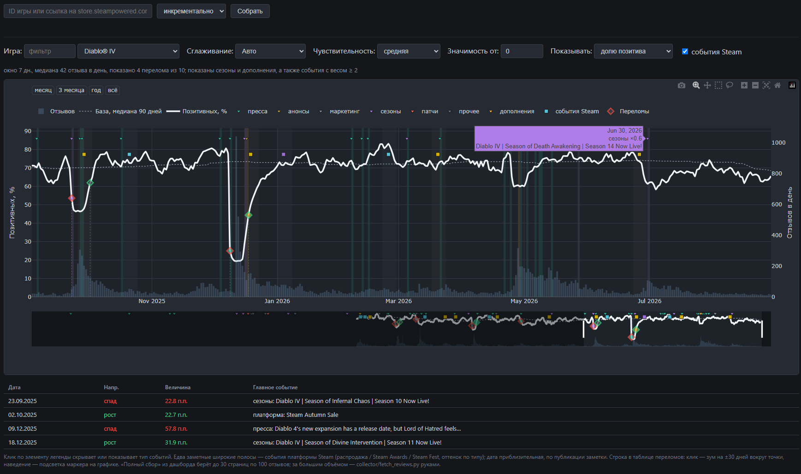
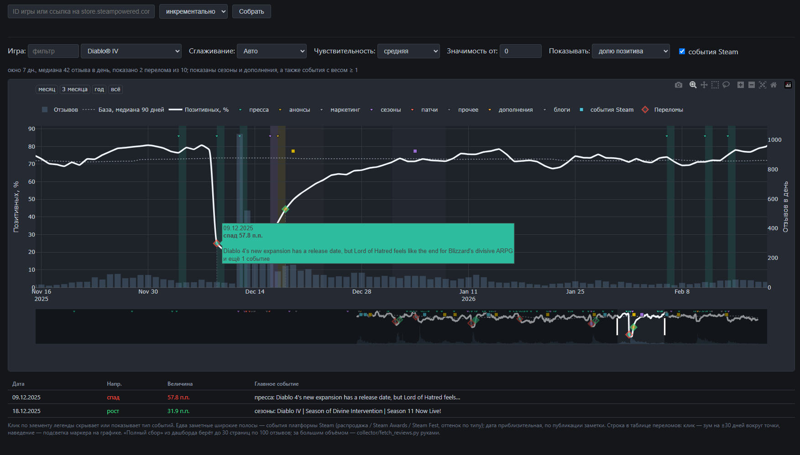

# steam-health

Аналитика здоровья игр в Steam: ищет день, когда патч или новость заметно сдвинули долю позитивных отзывов. Собирает отзывы и новости через Steam API, раскладывает их в хранилище и рисует кривую настроения с отметками событий и найденными точками перелома. Источников событий три: новости самой игры, внешняя игровая пресса (часть анонсов проходит мимо Steam) и события платформы целиком - распродажи, Steam Awards, Next Fest.



## Как устроено

`raw` хранит ответы Steam API как пришли, только дописывается. `core` - звезда: `dim_game` со SCD2-историей версий игры, факты по отзывам и патчам, справочники и мосты. `marts` - витрины поверх core, из них читает дашборд. Наполняет raw и core `collector/`, схему core держит `db/migration/`, витрины строит `dbt/`: витрина это всегда select над тем, что уже в базе, поэтому сразу после миграций marts пуста и её наполняет `dbt run`. Все таблицы, диаграммы и то, что реально заполняется, - в [docs/model.md](docs/model.md).

## Стек

Python, PostgreSQL 16, dbt, Docker, Flask + Plotly. Пробовал ещё Metabase и Power BI, не подошли - почему, написал в [журнале решений](docs/decisions.md).

## Запуск

Два сценария: целиком в docker, как на сервере, или дашборд локально - тогда в docker остаются только база и очередь, а `web/app.py` перезапускается сам при правке кода.

### Целиком в docker

```bash
cp .env.example .env   # заполнить пароль
docker compose up -d --build
```

Поднимутся postgres и redis, применятся миграции (разовый сервис `migrate`), соберутся витрины (разовый сервис `dbt`, после migrate и до web), запустится дашборд на gunicorn - http://localhost:5000.

### Локально

```bash
cp .env.example .env   # заполнить пароль
docker compose up -d postgres redis
python -m venv .venv && source .venv/bin/activate
pip install -r requirements.txt
python collector/migrate.py
set -a && source .env && set +a
export PYTHONPATH=collector
(cd dbt && dbt run)
python web/app.py       # http://localhost:5000, с автоперезагрузкой
```

Сервис `web` из compose здесь не поднимаю - иначе он и локальный `app.py` подерутся за порт 5000. Без `dbt run` схема marts после миграций останется пустой: дашборд поднимется, но без данных. Сам dbt `.env` не читает - в Python-скриптах это делает `python-dotenv`, а dbt берёт то, что уже есть в окружении процесса, отсюда `source .env` перед ним.

## Ручной сбор

Сборщики только складывают ответы Steam в `raw`, в ядро их переносят загрузчики, а витрины строит dbt. Пропуск любого шага оставляет дашборд пустым, поэтому цепочка целиком:

```bash
export PYTHONPATH=collector

python collector/fetch_appdetails.py      # карточки игр  -> raw.appdetails
python collector/fetch_news.py            # новости       -> raw.news
python collector/fetch_reviews.py 30      # отзывы        -> raw.reviews
python collector/fetch_platform_events.py # события Steam -> dim_platform_event

python collector/load_dim_game.py         # raw -> core.dim_game (SCD2)
python collector/load_fct_review.py       # raw -> fct_review, review_text
python collector/load_fct_patch.py        # raw -> fct_patch, вес событий

(cd dbt && dbt run)                       # core -> marts
```

Порядок внутри блоков важен: `load_dim_game.py` должен отработать до остальных загрузчиков, иначе события и отзывы не найдут версию игры и уедут в заглушку. `fetch_platform_events.py` пишет и в `raw.news`, и сразу в `core.dim_platform_event`, отдельного загрузчика у него нет; в фоновую задачу дашборда он не входит, и без ручного запуска третий источник событий просто отсутствует. `--app-id` и `--mode` он не знает: appid один и фид отдаётся целиком за один вызов. Есть `--load-only` - разобрать заново уже скачанное, не обращаясь к Steam.

Число у `fetch_reviews.py` - предел страниц по 100 отзывов. У него и у `fetch_news.py` есть `--mode`: по умолчанию `incremental`, качает только то, чего ещё нет, а `full` пересобирает заново. Без аргументов сборщик обходит все игры, по которым уже есть сырьё; `--app-id` ограничивает одной, в том числе новой, которой в базе ещё нет - так игра и заводится:

```bash
python collector/fetch_appdetails.py --app-id 1245620
python collector/fetch_reviews.py 5 --app-id 1245620 --mode full
```

## Сбор из дашборда

В шапке есть форма «ID игры или ссылка → Собрать»: она ставит задачу в очередь (Celery + Redis) и опрашивает её статус, не блокируя графики. Задача проверяет игру в Steam, качает appdetails, новости и отзывы, грузит их в core и в конце пересобирает витрины. Глубину задают `COLLECT_REVIEW_PAGES` (30 страниц по 100 отзывов) и `COLLECT_NEWS_PAGES` (10); за большим объёмом - коллекторы руками.

Сборы выполняются по одному: `/api/collect` берёт общий замок в Redis и любому следующему запросу отвечает 409 с id идущей задачи, чьей бы вкладки тот ни был. Дашборд в этом случае показывает чужой прогресс и предлагает повторить запуск позже.

Сервис `worker` - тот же образ, что `web`, командой `celery -A tasks worker`, поднимается вместе со всем остальным. Без него `/api/collect` вернёт `task_id`, но задача так и провисит в очереди.

Если в окружении задан `COLLECT_TOKEN`, `/api/collect` принимает только запрос с заголовком `X-Collect-Token`, равным ему, остальным отвечает 401. Токен уезжает в html страницы, так что это защита от случайного запроса, а не от целенаправленного - настоящая будет basic auth на обратном прокси (Caddy) при деплое.

## Как читать переломы

Детектор не доказывает причинно-следственную связь. Он ранжирует дни по силе сдвига доли позитива и показывает верхушку: для каждого дня берётся разница между средним за следующие семь дней и средним за предыдущие семь, а порогом служит среднее плюс несколько сигм от разброса самого ряда.



Порог относительный, поэтому число найденных точек зависит в первую очередь от настройки чувствительности, а не от того, насколько бурной была жизнь игры. У ровной игры на высокой чувствительности переломы найдутся тоже. События рядом с точкой (±3 дня) подставляются как возможное объяснение, и совпадение по времени - это всё, что о них известно.

Края ряда не оцениваются: сдвиг не считается, пока в окне «до» или «после» меньше трёх дней.

## Что где лежит

- `collector/` - сбор данных и загрузка в хранилище
- `db/migration/` - миграции схемы core
- `dbt/` - модели витрин marts
- `web/` - дашборд на Flask + Plotly
- `api/` - черновые запросы к Steam API в формате `.http`, которыми разведывались форматы ответов; не часть пайплайна
- [docs/model.md](docs/model.md) - модель данных: слои, схема core, витрины
- [docs/decisions.md](docs/decisions.md) - журнал решений: что решил и почему
- [docs/TODO.md](docs/TODO.md) - что не сделано и что отложено осознанно

Данные получены через публичный Steam Web API и принадлежат Valve; проект к Valve отношения не имеет.