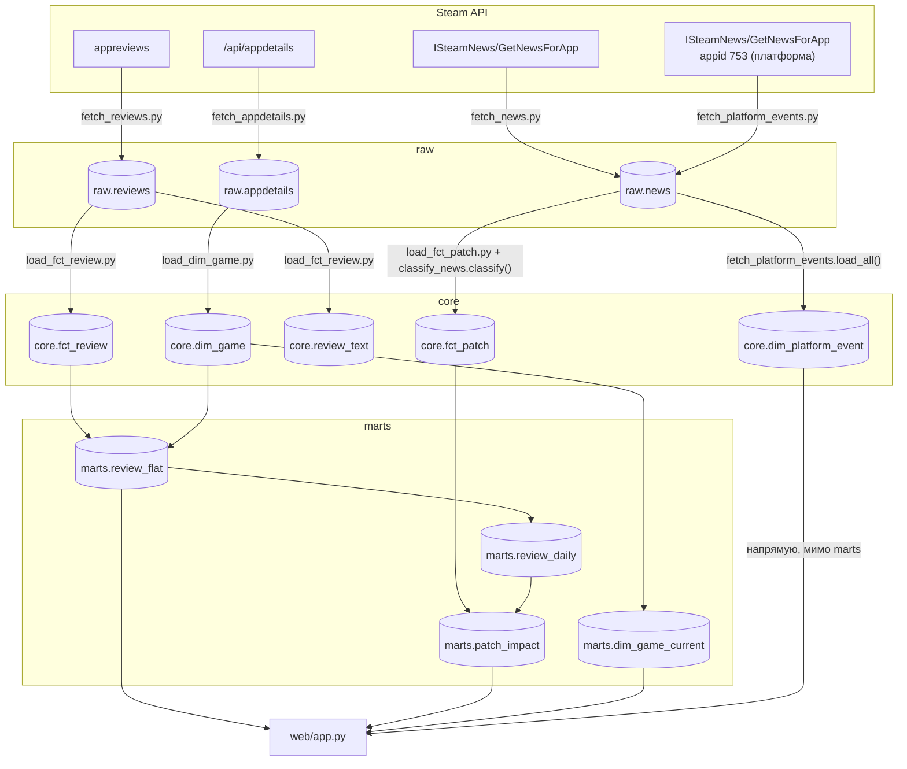

# Модель данных

Три слоя: `raw` хранит ответы Steam API как есть, append-only,
без единой трансформации. `core` — размерная модель (звезда):
измерения и факты, дедуплицированные и типизированные.
`marts` — витрины поверх core, из них читает дашборд. Разделение
нужно, чтобы дедупликация и разбор JSON происходили один раз
при загрузке, а не на каждый запрос витрины (см. [decisions.md](decisions.md), запись 017).

## Слои и потоки данных

Подробная версия с обязательным порядком загрузчиков и веткой
фоновой задачи (`web/tasks.py`) — [docs/er/pipeline.drawio](er/pipeline.drawio).

Особенности, которые не видны из схемы:

- `classify_news.py` не пишет в базу сам — это модуль с регулярками
  и функцией `classify()`, которую вызывает `load_fct_patch.py` при
  загрузке. У `classify_news.py` есть свой `main()`, но он только
  печатает распределение типов на экран — диагностика, а не часть
  пайплайна.
- `check_games.py` и `migrate.py` вне этой схемы: первый сверяет
  `games.txt` с ответами Steam и ничего не пишет в БД, второй
  применяет файлы из `db/migration/` и ведёт `public.schema_history`.
- Обязательный порядок: `load_fct_review.py` нужно перезапускать
  после каждого сбора отзывов, иначе `core` отстаёт от `raw`
  (см. TODO.md).

## Ядро: звезда в core

ER-диаграмма — [docs/er/core.drawio](er/core.drawio). GitHub
`.drawio` не рендерит — открыть можно в VS Code (расширение
Draw.io Integration) или на [diagrams.net](https://app.diagrams.net/).
Таблицы, нарисованные вручную и заполненные данными
(`dim_game`, `dim_date`, `dim_time`, `dim_language`, `fct_review`,
`fct_patch`, `review_text`), — обычным цветом; спроектированные,
но не заполняемые (`dim_company`, `dim_genre`, `dim_category`
и три моста `bridge_game_*`) — серым. `dim_window` заполняется
(миграцией), но не связана с фактами через FK — она в стороне,
с пометкой о `cross join` в `marts.patch_impact`.

Все таблицы — в схеме `core`. По каждой:

- **dim_game** — измерение игры, SCD2. Зерно: одна строка на
  версию атрибутов игры (`app_id` не уникален, уникален
  `app_id` среди строк с `is_current`). Новая версия появляется,
  когда меняются отслеживаемые поля (метакритик-оценка, тип
  приложения, статус раннего доступа и т.д.) — тогда старая
  строка получает `valid_to`, новая — `valid_from`. Строка
  `game_sk = -1, app_id = -1` — заглушка для фактов без
  распознанной игры. Пересечение интервалов `[valid_from,
  valid_to)` двух версий одного `app_id` запрещено ограничением
  исключения на уровне таблицы (миграция V30) — см.
  [decisions.md](decisions.md), запись 025.
- **dim_date** — календарь на 2012–2030, заполняется целиком
  миграцией V2, без ETL.
- **dim_time** — 24 строки, час 0–23, заполняется целиком
  миграцией V3, без ETL.
- **dim_language** — код и имя языка отзыва. Заполняется
  «на лету» из `load_fct_review.py`: язык, которого ещё нет,
  вставляется при первой встрече. Строка `language_sk = -1`
  — заглушка на случай пустого поля `language`. Колонка
  `language_name` не заполняется никогда — Steam API отдаёт
  только код языка (`schinese`, `russian`), человекочитаемое имя
  неоткуда взять без отдельного справочника, который не заводили.
- **dim_window** — 7 фиксированных окон до/после патча
  (`before_28` … `after_14`), заполняется целиком миграцией V12.
  Не связана ни с одним фактом через FK — используется в
  `marts.patch_impact` через `cross join`.
- **dim_company / dim_genre / dim_category** — справочники
  разработчика/издателя, жанра, категории. Спроектированы,
  но ни одна колонка ни разу не заполнена никаким скриптом.
- **fct_review** — транзакционный факт с элементами accumulating
  snapshot: зерно — один отзыв (`recommendation_id` уникален).
  У отзыва есть три временных вехи (`created_at`, `updated_at`,
  `dev_responded_at`), которые дозаполняются по мере жизни отзыва
  — это и есть накопительный снимок. Мутируемые меры (`votes_up`,
  `votes_funny`, `comment_count`, `weighted_vote_score`,
  `is_voted_up`) обновляются через `on conflict do update`
  при повторной загрузке. Колонка `refunded` не заполняется
  никогда — Steam API её в ответе не отдаёт вовсе, поле
  спроектировано на будущее. Собирается не вся история отзывов —
  см. «Известные особенности».
- **review_text** — текст отзыва отдельно от `fct_review`
  (1:1 по `review_sk`), чтобы не таскать длинный текст в каждый
  join с фактом.
- **fct_patch** — транзакционный факт: зерно — одна новость Steam
  (патч, анонс, пресса и т.д.), `gid` — натуральный ключ новости,
  уникален. Глубина истории ограничена тем, что вообще отдаёт
  Steam через `GetNewsForApp`. До постраничного обхода назад
  по времени (см. [decisions.md](decisions.md), запись 028) часть
  игр упиралась в потолок одного запроса — реально обрезаны были
  четыре игры из 21 (Baldur's Gate 3, Cyberpunk 2077, Destiny 2,
  Rust), у остальных близкие к 500 значения оказались их настоящим
  объёмом, не обрезкой. 497 строк здесь — с `game_sk = -1`:
  `load_fct_patch.py` читает `raw.news` без фильтра по `app_id`
  и грузит заодно фид платформы (appid 753), для которого игры
  в `dim_game` нет. Заглушка `Unknown` из V4 отрабатывает по
  назначению — факт без опознанной игры не теряется и не ломает
  загрузку.
- **bridge_game_company / bridge_game_genre / bridge_game_category**
  — факты без мер (factless fact), мосты many-to-many между игрой
  и компанией/жанром/категорией. Спроектированы, не заполняются:
  соответствующие измерения пусты, заполнять мосты нечем.
- **dim_platform_event** — события платформы Steam целиком
  (распродажи, Steam Awards, Next Fest), не игры: нет `game_sk`
  и вообще никакой связи с остальной звездой — как `dim_window`,
  она тоже сама по себе. Заполняется `fetch_platform_events.py`
  из фида appid 753 (служебный, не игра). `event_date` — дата
  публикации заметки, а не начала события — см. decisions.md,
  запись 023, там же реальная точность по проверке на трёх датах.

## Витрины marts

- **review_flat** — плоский список отзывов: `app_id`, `review_id`,
  `created_at`, `voted_up`, `language_code`, `created_date`.
  Строится из `core.fct_review` + `core.dim_game` + `core.dim_language`
  (суррогатные ключи разворачиваются в натуральные для удобства
  остальных витрин). До миграции V21 читала `raw.reviews` напрямую
  через `jsonb_array_elements` — подробности в decisions.md,
  запись 017.
- **review_daily** — дневной агрегат отзывов по игре: `app_id`,
  `day`, `review_count`, `positive_count`. Строится группировкой
  `marts.review_flat` по игре и дате, 9232 строки. Снимает
  диапазонное соединение отдельных отзывов с окнами в
  `patch_impact` — было 2.1 млрд промежуточных строк и 464
  секунды сборки, стало равенство по `(app_id, day)` на готовых
  дневных суммах — см. decisions.md, запись 030.
- **patch_impact** — по каждому патчу/событию и каждому окну
  из `dim_window`: число отзывов и число позитивных в этом окне,
  флаг `window_complete` (окно не обрезано границей собранных
  данных). Окна календарные: пара «событие + окно» разворачивается
  в список дат через `generate_series` и складывается
  с `marts.review_daily` по равенству `(app_id, day)`. День самого
  события не входит ни в `before`, ни в `after` — для патча,
  вышедшего 5 марта, `after_3` это 6, 7 и 8 марта целиком, не
  72 часа от момента публикации, как считалось раньше. Строится
  из `core.fct_patch` + `core.dim_game` + `core.dim_window`,
  агрегируя `marts.review_daily` — см. decisions.md, запись 030.
  Меры окон (`review_count`, `positive_count`, `window_complete`)
  читает таблица влияния событий (`/api/event_impact`) — окна
  `before_7`/`after_7` одного патча, сравнение доли позитива до
  и после. Маркеры и полосы на самом графике берут из этой же
  витрины только дату, тип, заголовок и вес, без окон — см.
  decisions.md, записи 015 и 026 (числа там посчитаны по прежней,
  временной семантике окон, до записи 030).
- **dim_game_current** — по одной строке на игру: текущая версия
  из `core.dim_game` (`is_current` и `app_id > 0`, реальные игры
  без заглушки). Нужна, потому что `core.dim_game` — SCD2
  и `app_id` там не уникален; для списка игр в интерфейсе
  и для join «один к одному» нужен именно текущий срез.

## Что заполняется, а что нет

Снимок на 2026-08-31 — таблицы растут по мере сбора, конкретные
числа дальше устареют. Порядок величины и какие таблицы вообще
заполняются — не устареет.

| Таблица | Заполняется чем | Статус |
|---|---|---|
| `raw.reviews` | `fetch_reviews.py` | Растёт по мере сбора, 13853 строк на снимок |
| `raw.news` | `fetch_news.py` + `fetch_platform_events.py` | Растёт по мере сбора, 82 строки на снимок |
| `raw.appdetails` | `fetch_appdetails.py` | 24 строки на 21 игру (часть переснята повторно) |
| `core.dim_game` | `load_dim_game.py` (SCD2) + заглушка -1 из миграции V4 | Заполнена, 23 версии на 21 игру |
| `core.dim_date` | миграция V2 | Заполнена целиком при миграции |
| `core.dim_time` | миграция V3 | Заполнена целиком при миграции (24 строки) |
| `core.dim_language` | `load_fct_review.py` (find-or-create) + заглушка -1 из V5 | Заполнена, 32 языка |
| `core.dim_window` | миграция V12 | Заполнена целиком при миграции (7 строк) |
| `core.dim_company` | — | Спроектирована, не заполняется |
| `core.dim_genre` | — | Спроектирована, не заполняется |
| `core.dim_category` | — | Спроектирована, не заполняется |
| `core.bridge_game_company` | — | Пусто |
| `core.bridge_game_genre` | — | Пусто |
| `core.bridge_game_category` | — | Пусто |
| `core.fct_review` | `load_fct_review.py` | Растёт по мере сбора, 967094 строк на снимок; до ~50 тыс. свежих отзывов на игру, не вся история — см. «Известные особенности» |
| `core.review_text` | `load_fct_review.py` | Заполнена вместе с `fct_review` |
| `core.fct_patch` | `load_fct_patch.py` | Растёт по мере сбора, 13358 строк на снимок |
| `core.dim_platform_event` | `fetch_platform_events.py` | Заполнена, 80 строк на снимок |

## Известные особенности

- **Собираем не всю историю отзывов, а до ~50 тысяч свежих
  на игру.** Для менее популярных игр это вся история, для
  крупных — только последние месяцы. Осознанно: задаче нужна
  плотность отзывов рядом с патчем, чтобы найти сдвиг настроения,
  а не полный архив с релиза. Следствие — `window_complete`
  в `patch_impact` помечает события старше границы сбора как
  необсчитываемые, и таблица влияния событий (`/api/event_impact`)
  показывает только то, что попало в собранный период.
- **SCD2 в dim_game, `valid_from` первой версии игры — 2000 год.**
  Первая версия игры получает открытую нижнюю границу
  (`FIRST_VERSION_FROM` в `load_dim_game.py`): игра существовала
  до начала сбора, и события за прошлые годы должны находить свою
  версию, а не улетать в заглушку `Unknown` — см.
  [decisions.md](decisions.md), запись 006. При SCD2-изменении
  новая версия по-прежнему получает `valid_from = now()`, момент
  изменения известен.
- **Связь патч ↔ отзыв — не через FK, а вычисляется по времени**
  (день отзыва совпадает с одной из календарных дат окна
  `published_at + day_from/day_to`, день самого события в окно
  не входит — запись 030) — см. [decisions.md](decisions.md),
  запись 010. Отзыв не привязан к конкретному патчу: игрок мог
  написать через год после десяти патчей подряд.
- **Доли не хранятся, только числитель и знаменатель**
  (`review_count`/`positive_count` в витринах, а не готовый
  процент) — среднее от долей по дням искажает картину, когда
  дни отличаются по объёму отзывов на порядки — см.
  [decisions.md](decisions.md), запись 008.
- **dim_game_current существует отдельно от dim_game**, потому
  что `dim_game` — SCD2, и `app_id` там не уникален: прямой join
  на «текущую» игру даёт задвоение или требует условие на
  `valid_from`/`valid_to` в каждом запросе. Изначально понадобился
  при работе с Power BI, где такая связь ломает модель данных
  вовсе — см. [decisions.md](decisions.md), запись 012. Сейчас
  используется и в `web/app.py`, для списка игр в интерфейсе.
- **`web/app.py` читает `core.dim_platform_event` напрямую, минуя
  marts** — единственное исключение из «marts — витрины, из них
  читает дашборд» в начале этого документа. Осознанно: витрина
  здесь агрегировала бы то, что и так уже готово к чтению (нет
  игры, по которой считать доли/суммы, нет фактов, с которыми
  джойнить) — лишний слой без функции.
