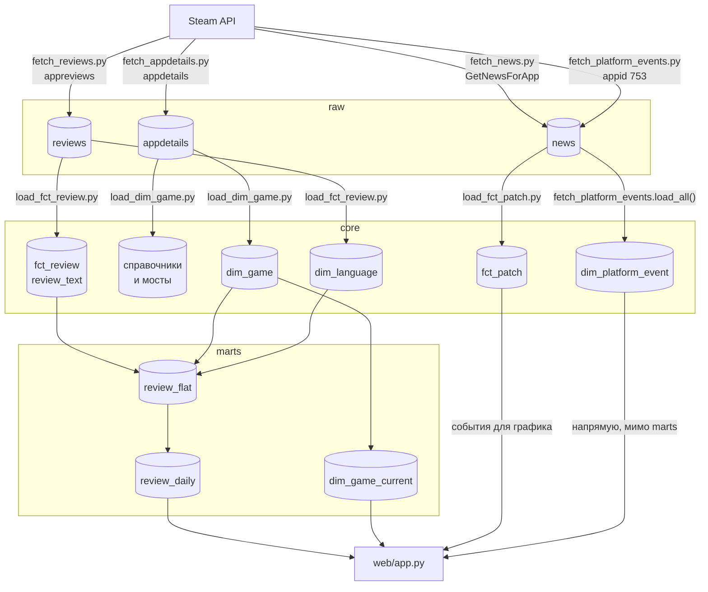
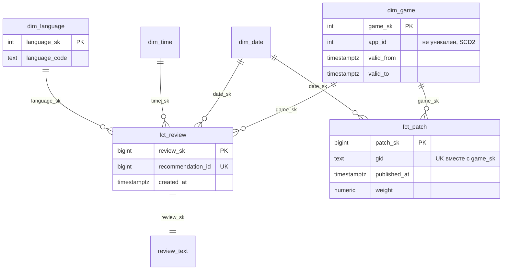
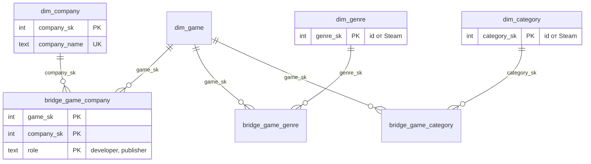

# Модель данных

Что где лежит и с каким зерном. Почему именно так - в
[decisions.md](decisions.md), сюда вынесены только ссылки на номера записей.

`raw` хранит ответы Steam API как есть, append-only. `core` - размерная модель:
измерения и факты, дедуплицированные и типизированные. `marts` - витрины поверх
core, из них читает дашборд. Разделение нужно, чтобы дедупликация и разбор JSON
происходили один раз при загрузке, а не на каждый запрос витрины (запись 017).

## Потоки данных

Подробная версия с порядком загрузчиков и веткой фоновой задачи -
[pipeline.drawio](er/pipeline.drawio).

Вне схемы: `classify_news.py` - регулярки, его `classify()` вызывает
`load_fct_patch.py`; `migrate.py` применяет файлы из `db/migration/` и ведёт
`public.schema_history` (в нумерации пропущен V22, запись 018). После каждого
сбора отзывов нужно перезапускать `load_fct_review.py`, иначе `core` отстаёт
от `raw`.

## Звезда в core

Атрибуты игры вынесены второй диаграммой: четырнадцать таблиц core в одной
читать невозможно.

Мосты `bridge_game_genre` и `bridge_game_category` устроены так же, без `role`.
Нарисованная от руки версия - [core.drawio](er/core.drawio); GitHub `.drawio`
не рендерит, открывается в VS Code или на diagrams.net.

Зерно и особенности по таблицам:

- **dim_game** - одна строка на версию атрибутов игры, SCD2. `app_id` уникален
  только среди `is_current`. Строка `game_sk = -1` - заглушка для фактов без
  распознанной игры. Пересечение интервалов `[valid_from, valid_to)` запрещено
  ограничением исключения `dim_game_no_overlap` (V30, запись 025). `valid_from`
  первой версии - 2000 год (запись 006).
- **fct_review** - один отзыв. Вехи `created_at`, `updated_at`,
  `dev_responded_at` дозаполняются по мере жизни отзыва, мутируемые меры -
  через `on conflict do update`. `refunded` пуста: Steam её не отдаёт.
- **fct_patch** - пара «событие - игра». Уникален не `gid`, а `(gid, game_sk)`:
  одна новость Steam может относиться к нескольким играм, и для каждой это свой
  факт со своим весом (V34).
- **dim_date**, **dim_time** заполняются целиком миграциями V2 и V3, без ETL.
  **dim_language** - на лету при первой встрече языка; `language_name` есть
  только у заглушки `-1`, для настоящих языков Steam отдаёт лишь код.
- **Справочники и мосты** заполняет `load_dim_game.py` из `raw.appdetails`
  (запись 035), на текущий `game_sk`.
- **dim_platform_event** - события платформы целиком, без `game_sk` и связей
  со звездой: это не игра. `event_date` - дата публикации заметки, не начала
  события (запись 023).

## Витрины marts

Описаны моделями в `dbt/models/`, точные определения смотреть там.

- **review_flat** - таблица, плоский список отзывов с натуральными ключами
  вместо суррогатных: `app_id`, `review_id`, `created_at`, `voted_up`,
  `language_code`, `created_date`. Заглушка `app_id = -1` отфильтрована.
- **review_daily** - таблица, дневной агрегат по игре: `app_id`, `day`,
  `review_count`, `positive_count`. Дашборд берёт ряд отсюда, а не
  пересчитывает его на каждый запрос.
- **dim_game_current** - представление, по строке на игру, текущая версия
  без заглушки. Нужна, потому что `app_id` в SCD2 не уникален (запись 012).

Витрин окон больше нет: `patch_impact` и `dim_window` удалены в V33 и V35
вместе с таблицей влияния событий, события для графика дашборд читает прямо
из `core.fct_patch`.

## Что заполняется

Снимок на 2026-09-05. Числа устареют, порядок величины - нет.

| Таблица | Чем заполняется | Строк |
|---|---|---|
| `raw.reviews` | `fetch_reviews.py` | 21 446 |
| `raw.news` | `fetch_news.py`, `fetch_platform_events.py` | 86 |
| `raw.appdetails` | `fetch_appdetails.py` | 29 |
| `core.dim_game` | `load_dim_game.py` + заглушка из V4 | 23 версии на 21 игру |
| `core.dim_date` | миграция V2 | 10 227 |
| `core.dim_time` | миграция V3 | 24 |
| `core.dim_language` | `load_fct_review.py` + заглушка из V5 | 32 |
| `core.dim_company` | `load_dim_game.py` | 26 |
| `core.dim_genre` | `load_dim_game.py` | 10 |
| `core.dim_category` | `load_dim_game.py` | 52 |
| `core.bridge_game_company` | `load_dim_game.py` | 43 |
| `core.bridge_game_genre` | `load_dim_game.py` | 67 |
| `core.bridge_game_category` | `load_dim_game.py` | 396 |
| `core.fct_review` | `load_fct_review.py` | 1 439 966 |
| `core.review_text` | `load_fct_review.py` | 1 439 966 |
| `core.fct_patch` | `load_fct_patch.py` | 13 418 |
| `core.dim_platform_event` | `fetch_platform_events.py` | 80 |
| `marts.review_flat` | dbt | 1 439 966 |
| `marts.review_daily` | dbt | 10 578 |
| `marts.dim_game_current` | dbt | 21 |

## Известные особенности

- **Собирается не вся история отзывов, а свежий хвост: не меньше 50 тыс.
  на игру.** Разброс по 21 игре - от 50 044 до 161 565, медиана 50 564. Задаче
  нужна плотность отзывов рядом с патчем, а не полный архив с релиза.
- **Связь патча и отзыва вычисляется по времени, а не через FK** (запись 010):
  игрок мог написать через год после десяти патчей подряд.
- **Доли не хранятся, только числитель и знаменатель** (запись 008): среднее
  от долей по дням искажает картину, когда дни отличаются по объёму на порядки.
- **`web/app.py` читает `core.dim_platform_event` напрямую, минуя marts** -
  единственное исключение из «витрины для дашборда»: витрина агрегировала бы
  то, что и так готово к чтению.
