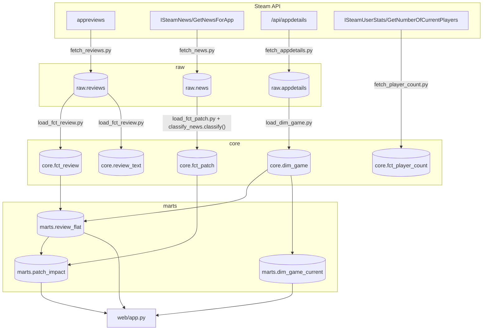
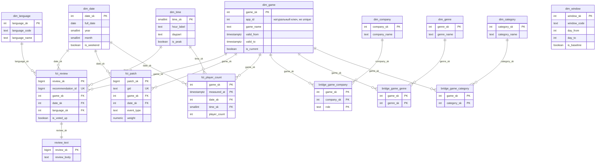

# Модель данных

Три слоя: `raw` хранит ответы Steam API как есть, append-only,
без единой трансформации. `core` — размерная модель (звезда):
измерения и факты, дедуплицированные и типизированные.
`marts` — витрины поверх core, из них читает дашборд. Разделение
нужно, чтобы дедупликация и разбор JSON происходили один раз
при загрузке, а не на каждый запрос витрины (см. [decisions.md](decisions.md), запись 017).

## Слои и потоки данных

Особенности, которые не видны из схемы:

- `fetch_player_count.py` пишет в `core.fct_player_count` напрямую,
  минуя `raw`: Steam отдаёт только текущее число игроков, хранить
  сырой ответ на одно число избыточно.
- `classify_news.py` не пишет в базу сам — это модуль с регулярками
  и функцией `classify()`, которую вызывает `load_fct_patch.py` при
  загрузке. У `classify_news.py` есть свой `main()`, но он только
  печатает распределение типов на экран — диагностика, а не часть
  пайплайна.
- `check_games.py` и `migrate.py` вне этой схемы: первый сверяет
  `games.txt` с ответами Steam и ничего не пишет в БД, второй
  применяет файлы из `db/migration/` и ведёт `public.schema_history`.
- Обязательный порядок: `load_fct_review.py` нужно перезапускать
  после каждого сбора отзывов, иначе `core` отстаёт от `raw`
  (см. TODO.md).

## Ядро: звезда в core

Все таблицы — в схеме `core`. По каждой:

- **dim_game** — измерение игры, SCD2. Зерно: одна строка на
  версию атрибутов игры (`app_id` не уникален, уникален
  `app_id` среди строк с `is_current`). Новая версия появляется,
  когда меняются отслеживаемые поля (метакритик-оценка, тип
  приложения, статус раннего доступа и т.д.) — тогда старая
  строка получает `valid_to`, новая — `valid_from`. Строка
  `game_sk = -1, app_id = -1` — заглушка для фактов без
  распознанной игры.
- **dim_date** — календарь на 2012–2030, заполняется целиком
  миграцией V2, без ETL.
- **dim_time** — 24 строки, час 0–23, заполняется целиком
  миграцией V3, без ETL.
- **dim_language** — код и имя языка отзыва. Заполняется
  «на лету» из `load_fct_review.py`: язык, которого ещё нет,
  вставляется при первой встрече. Строка `language_sk = -1`
  — заглушка на случай пустого поля `language`.
- **dim_window** — 7 фиксированных окон до/после патча
  (`before_28` … `after_14`), заполняется целиком миграцией V12.
  Не связана ни с одним фактом через FK — используется в
  `marts.patch_impact` через `cross join`.
- **dim_company / dim_genre / dim_category** — справочники
  разработчика/издателя, жанра, категории. Спроектированы,
  но ни одна колонка ни разу не заполнена никаким скриптом.
- **fct_review** — транзакционный факт с элементами accumulating
  snapshot: зерно — один отзыв (`recommendation_id` уникален).
  У отзыва есть три временных вехи (`created_at`, `updated_at`,
  `dev_responded_at`), которые дозаполняются по мере жизни отзыва
  — это и есть накопительный снимок. Мутируемые меры (`votes_up`,
  `votes_funny`, `comment_count`, `weighted_vote_score`,
  `is_voted_up`) обновляются через `on conflict do update`
  при повторной загрузке.
- **review_text** — текст отзыва отдельно от `fct_review`
  (1:1 по `review_sk`), чтобы не таскать длинный текст в каждый
  join с фактом.
- **fct_patch** — транзакционный факт: зерно — одна новость Steam
  (патч, анонс, пресса и т.д.), `gid` — натуральный ключ новости,
  уникален.
- **fct_player_count** — periodic snapshot: зерно — одно измерение
  числа игроков в момент времени (`game_sk`, `measured_at`).
  История не восстановима назад, копится только с даты запуска
  сбора.
- **bridge_game_company / bridge_game_genre / bridge_game_category**
  — факты без мер (factless fact), мосты many-to-many между игрой
  и компанией/жанром/категорией. Спроектированы, не заполняются:
  соответствующие измерения пусты, заполнять мосты нечем.

## Витрины marts

- **review_flat** — плоский список отзывов: `app_id`, `review_id`,
  `created_at`, `voted_up`, `language_code`, `created_date`.
  Строится из `core.fct_review` + `core.dim_game` + `core.dim_language`
  (суррогатные ключи разворачиваются в натуральные для удобства
  остальных витрин). До миграции V21 читала `raw.reviews` напрямую
  через `jsonb_array_elements` — подробности в decisions.md,
  запись 017.
- **patch_impact** — по каждому патчу/событию и каждому окну
  из `dim_window`: число отзывов и число позитивных в этом окне
  вокруг `published_at`, флаг `window_complete` (окно не обрезано
  границей собранных данных). Строится из `core.fct_patch` +
  `core.dim_game` + `core.dim_window`, агрегируя `marts.review_flat`.
  Это основной источник данных для отметок событий на графике.
- **dim_game_current** — по одной строке на игру: текущая версия
  из `core.dim_game` (`is_current` и `app_id > 0`, реальные игры
  без заглушки). Нужна, потому что `core.dim_game` — SCD2
  и `app_id` там не уникален; для списка игр в интерфейсе
  и для join «один к одному» нужен именно текущий срез.

## Что заполняется, а что нет

| Таблица | Заполняется чем | Статус |
|---|---|---|
| `raw.reviews` | `fetch_reviews.py` | Растёт, сбор идёт (в т.ч. прямо сейчас) |
| `raw.news` | `fetch_news.py` | Заполнена (38 строк) |
| `raw.appdetails` | `fetch_appdetails.py` | Заполнена, по строке на игру (19) |
| `core.dim_game` | `load_dim_game.py` (SCD2) + заглушка -1 из миграции V4 | Заполнена, 21 версия на 19 игр |
| `core.dim_date` | миграция V2 | Заполнена целиком при миграции |
| `core.dim_time` | миграция V3 | Заполнена целиком при миграции (24 строки) |
| `core.dim_language` | `load_fct_review.py` (find-or-create) + заглушка -1 из V5 | Заполнена, 32 языка |
| `core.dim_window` | миграция V12 | Заполнена целиком при миграции (7 строк) |
| `core.dim_company` | — | Спроектирована, не заполняется |
| `core.dim_genre` | — | Спроектирована, не заполняется |
| `core.dim_category` | — | Спроектирована, не заполняется |
| `core.bridge_game_company` | — | Пусто |
| `core.bridge_game_genre` | — | Пусто |
| `core.bridge_game_category` | — | Пусто |
| `core.fct_review` | `load_fct_review.py` | Заполнена (602219 строк на момент загрузки) |
| `core.review_text` | `load_fct_review.py` | Заполнена вместе с `fct_review` |
| `core.fct_patch` | `load_fct_patch.py` | Заполнена (6690 строк) |
| `core.fct_player_count` | `fetch_player_count.py` | По одному замеру на игру (19 строк) — история копится с даты запуска сбора по расписанию |

## Известные особенности

- **SCD2 в dim_game, `valid_from` первой версии игры — 2000 год.**
  Первая версия игры получает открытую нижнюю границу
  (`FIRST_VERSION_FROM` в `load_dim_game.py`): игра существовала
  до начала сбора, и события за прошлые годы должны находить свою
  версию, а не улетать в заглушку `Unknown` — см.
  [decisions.md](decisions.md), запись 006. При SCD2-изменении
  новая версия по-прежнему получает `valid_from = now()`, момент
  изменения известен.
- **Связь патч ↔ отзыв — не через FK, а вычисляется по времени**
  (`created_at` отзыва внутри окна `published_at + day_from/day_to`
  патча) — см. [decisions.md](decisions.md), запись 010. Отзыв
  не привязан к конкретному патчу: игрок мог написать через год
  после десяти патчей подряд.
- **Доли не хранятся, только числитель и знаменатель**
  (`review_count`/`positive_count` в витринах, а не готовый
  процент) — среднее от долей по дням искажает картину, когда
  дни отличаются по объёму отзывов на порядки — см.
  [decisions.md](decisions.md), запись 008.
- **dim_game_current существует отдельно от dim_game**, потому
  что `dim_game` — SCD2, и `app_id` там не уникален: прямой join
  на «текущую» игру даёт задвоение или требует условие на
  `valid_from`/`valid_to` в каждом запросе. Изначально понадобился
  при работе с Power BI, где такая связь ломает модель данных
  вовсе — см. [decisions.md](decisions.md), запись 012. Сейчас
  используется и в `web/app.py`, для списка игр в интерфейсе.
